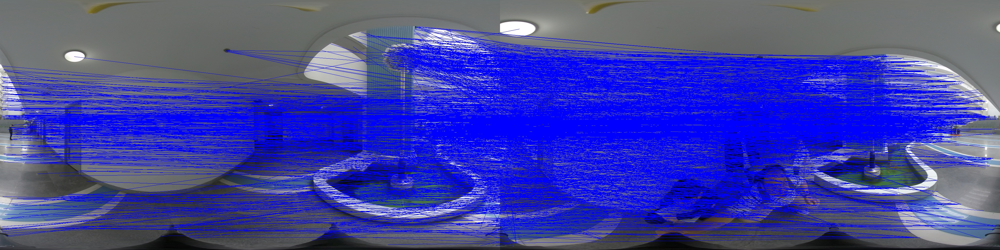
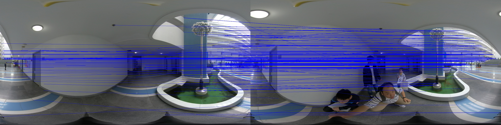

## 基于全景图片的室内外定位

### 问题重述
---
* 六台分视角相机拍摄的照片不是标准的鱼眼投影模型，通过给定内参矩阵和畸变参数校正照片，不可避免的产生像素的失真，导致六张相连的畸变照片无法拼接成常见的小孔投影照片，所以我们直接在畸变的全景图像上找寻特征点。
* 由于视角原因和遮挡物存在，70多张全景图像都存在相同的特征点的可能性很小，即使存在，当再次换个角度拍摄其他照片时，不一定存在上述70多张畸变全景图片共同的特征点。同时还存在一些隐患和重大缺漏问题，比如共同特征点在某些图片并不是特征点对应匹配的实际点。



- 上图中，那盏亮灯为标记的实际点，但是左边的那幅图的标记点并不对应右边那盏灯所在画幅中的实际点。虽然有大量的点很好的匹配上了，但是也有不少坏的匹配点。因为特征点的描述符是128个属性组成，具体代表什么，SIFT算法并没有告诉我们，特征点的匹配也不是单纯的数值比对，因为一些实际点会由于拍摄的视角、成像的投影、成像后实际物体的透视等因素，为匹配带来障碍，使用cv2库中的最邻近匹配算法(knnMatch)，我们进一步筛选出两张图片中一些匹配程度很高的特征点。



- 我们发现上图中，两盏亮灯的连线被剔除掉了，保留了匹配程度很高的特征点，同时带来了特征点匹配数目大量的减少，那找出在70多张全景图像中共同存在的特征点雪上加霜，而且未考虑行人流动遮挡、景深环境下镂空设计、全景图像拼接过程中信息的损失等因素。

### 基于特征点的匹配

---

#### 鱼眼全景的特征

- 每个场景有70多张图片，每个鱼眼全景图片的画幅大小为1920*960，使用opencv库中SIFT算法提取的特征点达上千。
- 每张畸变的全景图片左右可以衔接在一起，靠近成像中心的图像区域畸变程度高。
- 因为特征点的匹配是两张图片的特征点的对应关系，在前面的问题重述中，分析了找出全部全景图片共同的特征点是困难的，且不科学的，会出现一叶遮目的情形（流动的人群遮挡，景深场景不适用）。我们选取第一张图片为参考图像，第一幅图像特征点的坐标和描述符与其他图像做参考。

#### SIFT算法的特征点和描述子

> 返回关键点和描述符函数detectAndDescribe：

```python
keypointsPosition = {}
keypoints = {}
descriptors = {}
for imgName in imgNames:
    img = cv2.imread(imgName)
    imglist = imgName.split('/')
    sift = cv2.xfeatures2d.SIFT_create()
    (kps, des) = sift.detectAndCompute(img, None)
    kp = np.float32([kp.pt for kp in kps])

    keypointsPosition[imglist[6]] = kp
    keypoints[imglist[6]] = kps
    descriptors[imglist[6]] = des
```


1. 利用cv2.cvtColor函数将图像转换成灰度值（opencv 之前版本需要转化成灰度值）；
2. 使用opencv3环境下的cv2.xfeatures2d.SIFT_create函数创建sift对象；
3. 利用sift对象detectAndCompute计算关键点kps和描述符des；
4. kps为关键点类的列表，des为numpy的数组，des的行数为kps的行数，列数为128；
5. 每个特征点kp（kp属于kps）有六类属性：角度、大小、坐标等，获取坐标kp.pt。


> 匹配关键点函数matchKeyPoints：

```python
matcher = cv2.DescriptorMatcher_create('BruteForce')
matches = matcher.knnMatch(descriptors[pic1], descriptors[pic2], 2)
```

1. cv2中的函数描述符匹配初始化函数（参数为BF）创造对象matcher，输入参数为两张图片的特征点和描述子和比例；
2. 使用knnMatcher方法获得描述符匹配结果matches；
3. matches返回匹配列表的列表，匹配列表有两个DMatch类型的参数。

> 取理想匹配good：

```python
good = []
for m in matches:
	if len(m) == 2 and  m[0].distance < ratio * m[1].distance:
		good.append((m[0].trainIdx, m[0].queryIdx))
```

1. 遍历匹配列表，如果列表m的长度为2且第一个属性的distance参数小于第二个参数的一定比例，则认为这对匹配点是好的匹配点，并添加匹配列表的第一个元素的trianIdx和queryIdx的值；
2. 第一个trainIdx值代表第二幅匹配良好特征点的下标索引，queryIdx为第一幅特征点的下标索引；
3. good为第一幅图像与第二个图像匹配良好的特征点由下标索引组成的元祖的列表；
4. 下标元祖的含义：第一个元素为第二幅图像的像素坐标，第二个为第一幅图像的像素坐标。

#### 利用good的匹配结果整理数据集

##### 特征点描述符的匹配结果

```python
MatcherPositionData = {pic:{} for pic in picture}
MatcherPositionData[pic1][pic2]=[good_pic1_pts,good_pic2_pts]
```

* 我们创建一个由字典组成的字典 *MatcherPositionData* 储存给定的全景图像任意两张图片的特征点匹配的像素坐标，字典的元素为一个列表，列表的第一个元素表示*picture 1*的像素坐标，第二个元素表示*picture 2*的像素坐标。

```python
picture = load('picNames')
ref_pic_name = picture[0]
databaseRef = {}
for pic in picture:
    databaseRef[pic] = mpd[pic][ref_pic_name]
```

* 根据全景图像的特征，我们只需要提取与参考图像*ref_pic_name*的匹配的结果，作为数据集使用。

#### 预测测试集中相机的坐标位置

```python
x=[]
y=[]
# pic = picture[0]
for pic in picture:
    temp = []
    for i in range(1):
        temp.append(mpd[pic][0][i, 0])
        temp.append(mpd[pic][0][i, 1])
        t0 = (mpd[pic][1][i, 0] - mpd[pic][0][i, 0])
        t1 = (mpd[pic][1][i, 1] - mpd[pic][0][i, 1])
        temp.append(t0)
        temp.append(t1)
    x.append(temp)
    y.append(location[pic])

x_train, x_test, y_train, y_test = train_test_split(x, y, test_size=0.3)
regr = linear_model.LinearRegression()
regr.fit(X,Y)
```

* 预测相机的坐标位置采用了线性回归模型，这个模型看似有点简单，与其他非线性回归模型相比，误差很小，不仅体现在水平面上，而且在高度预测也相当准确。
* 相机坐标预测误差的平均值为$[1.1602324881417405, -0.45192860921224093, 0.10955032970791774]$，三列分别为XYZ坐标系的均值误差。方差为$[23.984018185320906, 30.106741780013458, 0.8073556666755958]$
* 我们采取过二次，三次多项式模型预测相机坐标位置，结果不尽人意。很有意思的一点是，当输入特征点的数目越多时，误差会越大，误差值大概是单个特征点的误差乘以回归特征点的数目，就是我们在上面代码展示的*range(1)*，为什么参数数目越多，预测误差越大，我们尚未搞清楚机理。